# Faire Maus - Bauanleitung

<!--
SPDX-FileCopyrightText: 2015 Susanne Jordan <jordan@nager-it.de>
SPDX-FileCopyrightText: 2025 Joram Ulmke <joramulmke@proton.me>
SPDX-FileCopyrightText: 2025 - 2026 Robin Vobruba <hoijui.quaero@gmail.com>

SPDX-License-Identifier: CC-BY-SA-4.0
-->

Aktuell (Stand 12/2025) verschicken wir 3-tastige Bausätze.

## Inhaltsverzeichnis

- [Übersicht der Einzelteile](#übersicht-der-einzelteile)
- [Benötigte Werkzeuge](#benötigte-werkzeuge)
- [Platine bestücken](#platine-bestücken)
- [Unterschale bearbeiten für dritte Taste](#unterschale-bearbeiten-für-dritte-taste)
- [Sensor-Folie abziehen](#sensor-folie-abziehen)
- [Finaler Zusammenbau](#finaler-zusammenbau)

## Übersicht der Einzelteile

| | |
| --- | ------ |
| 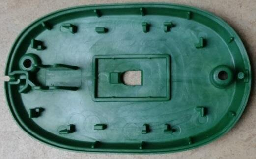 | Bodenplatte |
| 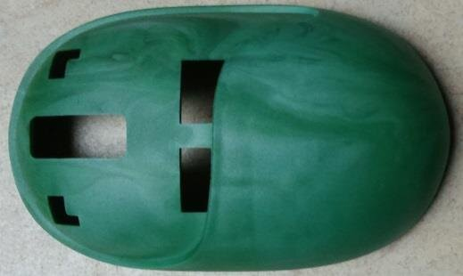 | Oberschale |
|  | Rechte Taste |
| 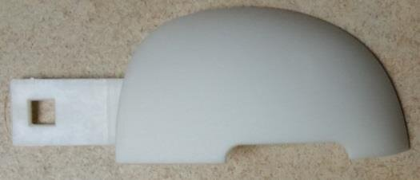 | Linke Taste |
| 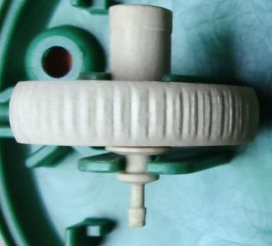 | Hölzernes Mausrad |
|  | Optik (Linse) |
| 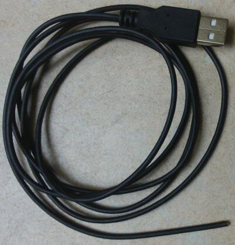 | USB Kabel |
| 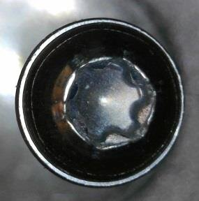 | Torx (Vielzahn) Schraube (2 x T9 und 2 x T10) |
| 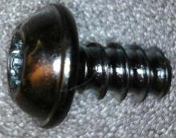 | 2 x für Maustasten |
| 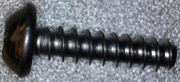 | 2 x Schraube für Gehäuse |
|  | 2 x Kondensatoren 0,1µF |
|  | Kondensator 10µF |
| 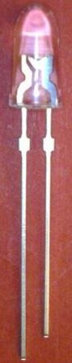 | LED Grün / Rot |
| 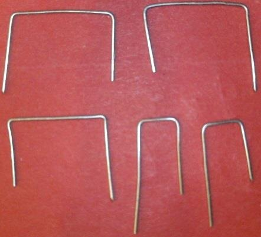 | 5 x Drahtbrücken, da Platine einseitig |
|  | 2 x Schalter für Linke und Rechte Taste |
| 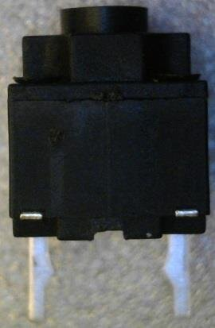 | Schalter für Mitteltaste |
|  | Drehgeber für Mausrad |
| 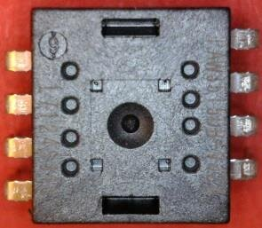 | Herzstück der Maus: Optischer Sensor, Prozessor und USB Schnittstelle |
| 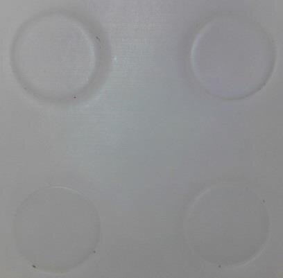 | Gleitplättchen |

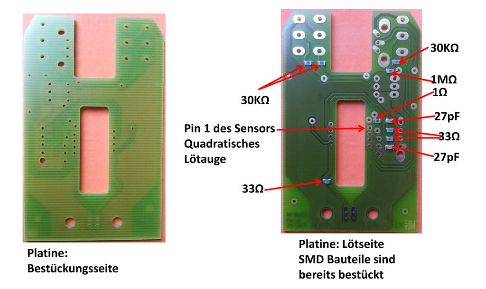

Platine (Vorder- und Rückseite mit Erklärung)

## Benötigte Werkzeuge

| | |
| --- | ------ |
| 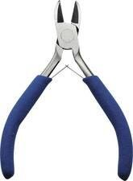 | Elektronik (fein) Seitenschneider |
| 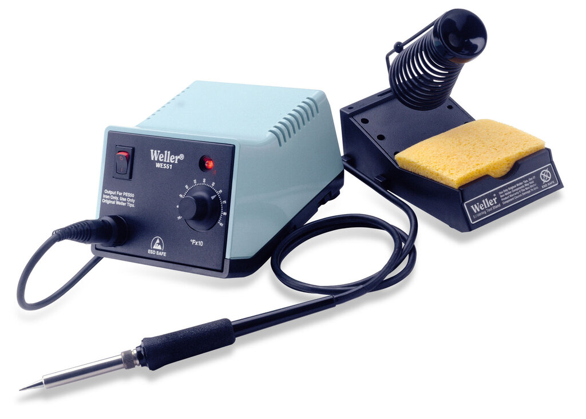 | Lötstation |
| 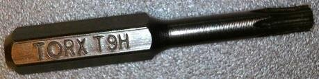 | Torx T9 Bit |
|  | Torx T10 Bit |
| 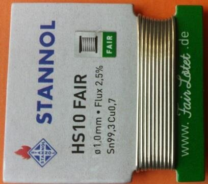 | Bleifreies Lötzinn |

## Platine bestücken

Beim Bestücken der Platine gibt es eine Reihenfolge, welche einzuhalten äußerst ratsam ist.
Die Bauteile werden immer von flach (z.B. Drahtbrücken, Widerstände, …)
nach hoch (z.B. Schalter, Kondensatoren, …) sortiert.
Als vorletztes werden Anschluss-Leitungen verlötet,
da diese ansonsten während dem Bestücken und Löten stören können.
Der optische Maussensor/Prozessor wird ganz zum Schluss bestückt.

> **WARNUNG** Immer erst ein Bein eines Bauteiles verlöten
> und dann den korrekten Sitz kontrollieren
> (z.B.: liegen die Bauteile/Drähte sauber auf der Platine auf?).

### Schlechtes Beispiel

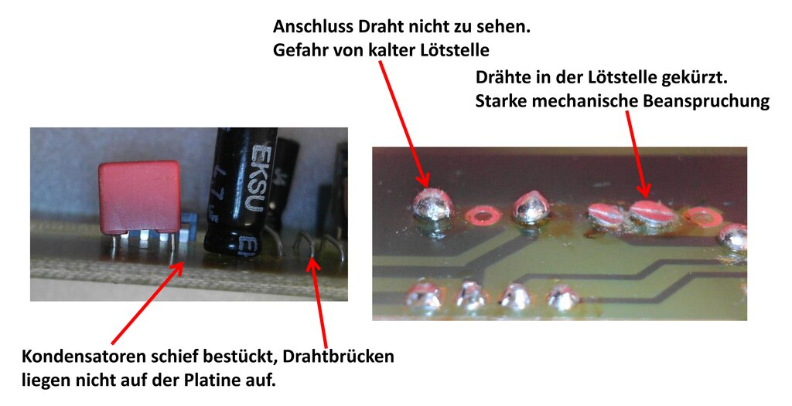

### Drahtbrücken bestücken

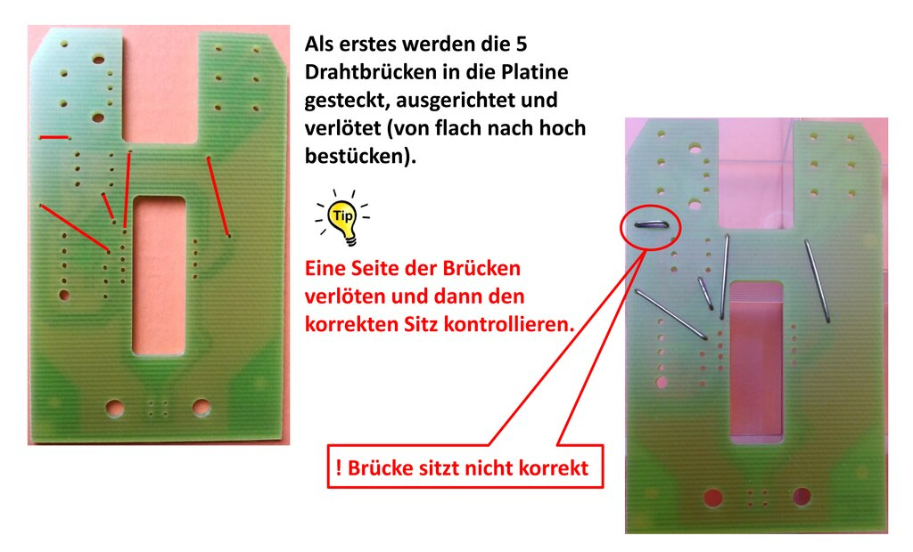

### Kondensatoren und LED bestücken

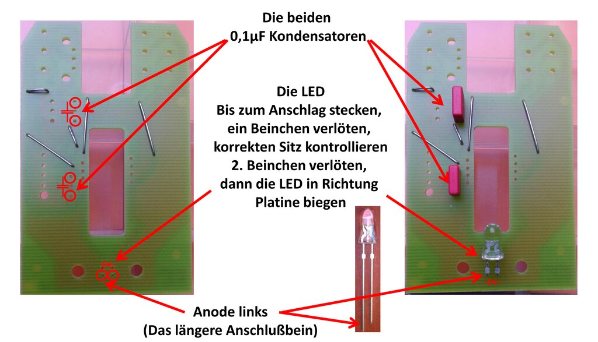

### Taster bestücken

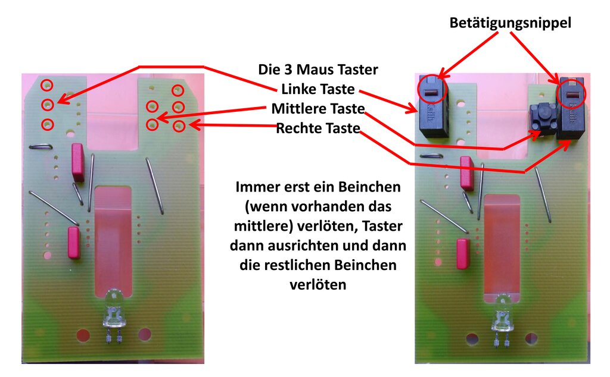

### Elko bestücken

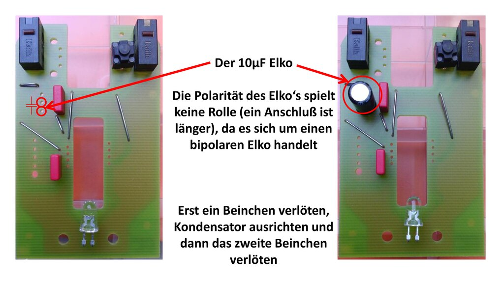

### Drehgeber bestücken

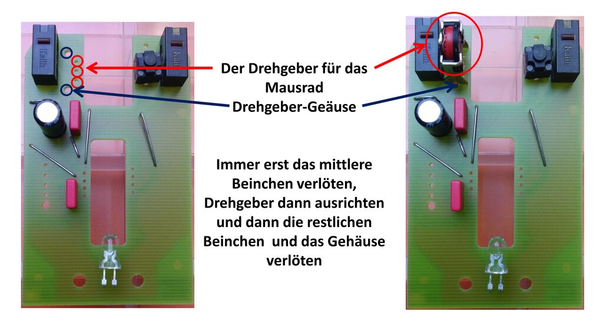

### USB Kabel

1. Die Kabelisolation ca. 25mm vom Ende her (Hülle)
   mit einem nicht zu scharfen Messer vorsichtig einkerben.

   | | |
   | --- | --- |
   | 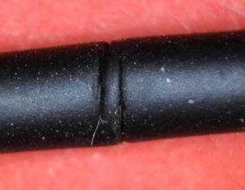 | ---Markdown-made-me-do-this--- |

2. Die Kabelisolation (Hülle) vorsichtig (mit dem Daumennagel) abziehen.

   | | |
   | --- | ------ |
   | 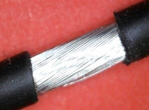 | 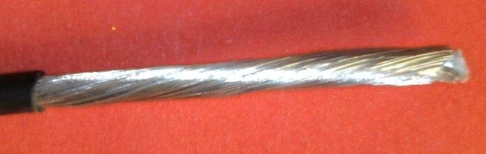 |

3. Die Drahtschirmung vorsichtig abwickeln
   (die feinen Drähte können stechen wie Nadeln).

   | | |
   | --- | --- |
   | 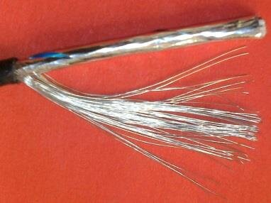 | ---Markdown-made-me-do-this--- |

4. Drahtschirm verdrillen und den Folienschirm abwickeln.

   | | |
   | --- | --- |
   | 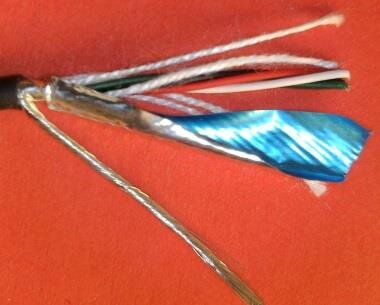 | ---Markdown-made-me-do-this--- |

5. Die Füllfäden mit einem Messer oder Seitenschneider abschneiden.

   | | |
   | --- | --- |
   | 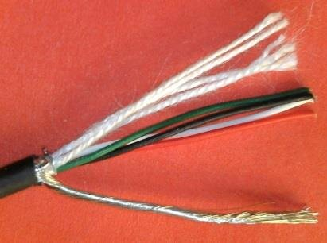 | ---Markdown-made-me-do-this--- |

6. Das Ende des verdrillten Schirmgeflechtes verzinnen.

   | | |
   | --- | --- |
   | 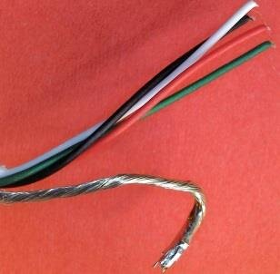 | ---Markdown-made-me-do-this--- |

7. Die Isolation der farbigen Adern an den Enden vorsichtig maximal 3mm entfernen.

   | | |
   | --- | --- |
   | 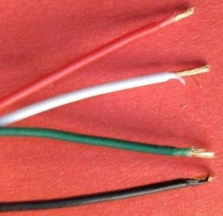 | ---Markdown-made-me-do-this--- |

8. Die Adern-Enden verzinnen.
   Die Isolation zieht sich durch die Hitze noch weiter zurück.

   | | |
   | --- | --- |
   | 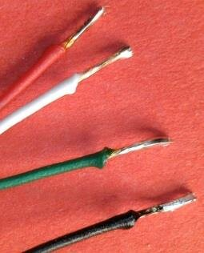 | ---Markdown-made-me-do-this--- |

9. Nun kann das USB Kabel in die Platine eingelötet werden.

   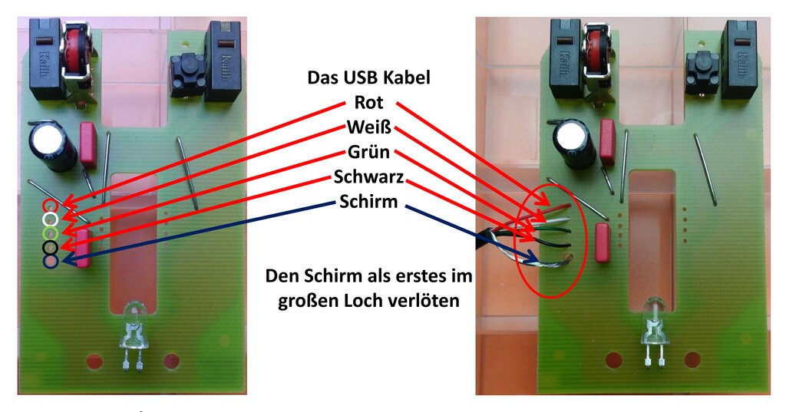

Eine gute Lötstelle zeichnet sich durch eine glänzende Oberfläche aus
(mit bleihaltigem Lötzinn).
Bleifreies Lötzinn ergibt immer eine matte Oberfläche:

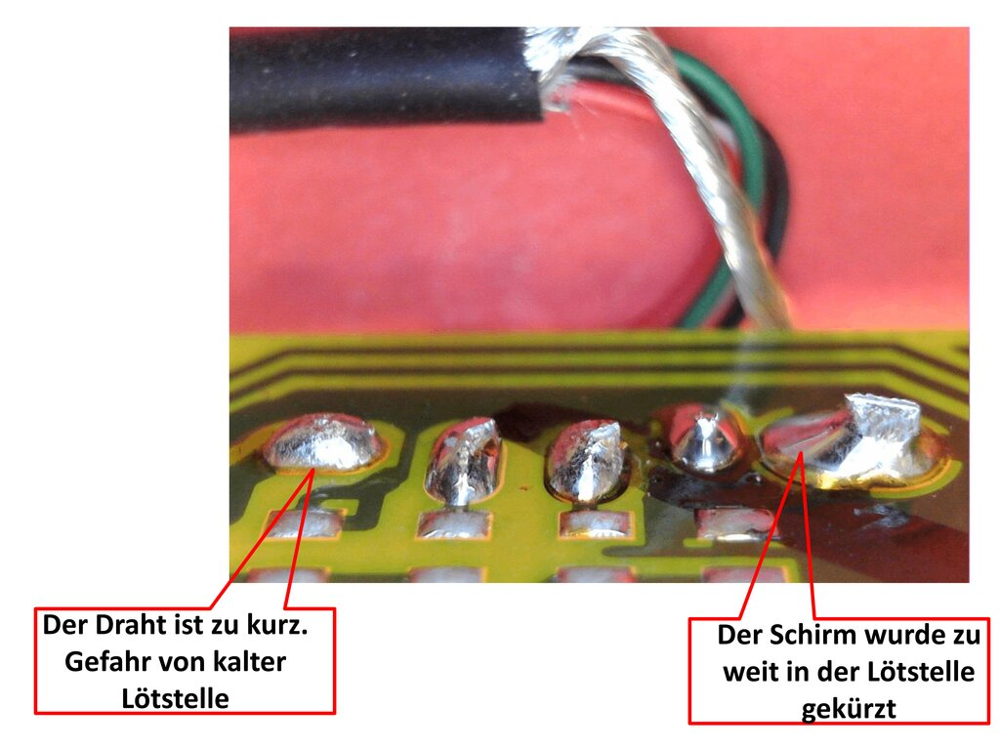

### Sensor bestücken

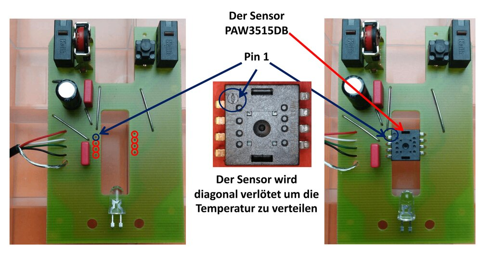

> **WARNUNG** Um Schäden des Sensors durch elektrische Ladungen zu verhindern,
> sollte man sich vor dem Berühren des Sensors selbst entladen haben,
> z.B. an der Erdung der Steckdose oder dem Metall eines Heizkörpers.

## Unterschale bearbeiten für dritte Taste

In der rechten Aufhängung des Scrollrad muss unten das hochstehende Mittelteil entfernt werden, damit das Drücken der dritten Taste funktioniert.

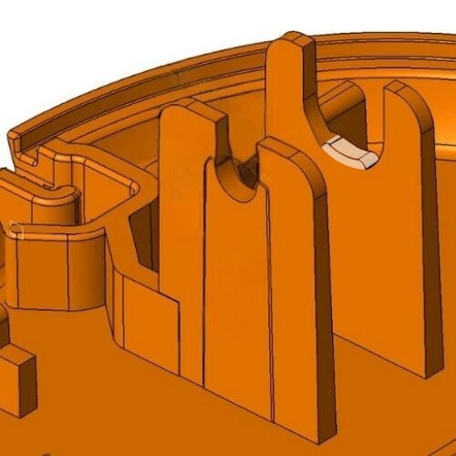

## Sensor-Folie abziehen

Ziehe nun vorsichtig die Folie vom Sensor (Chip).

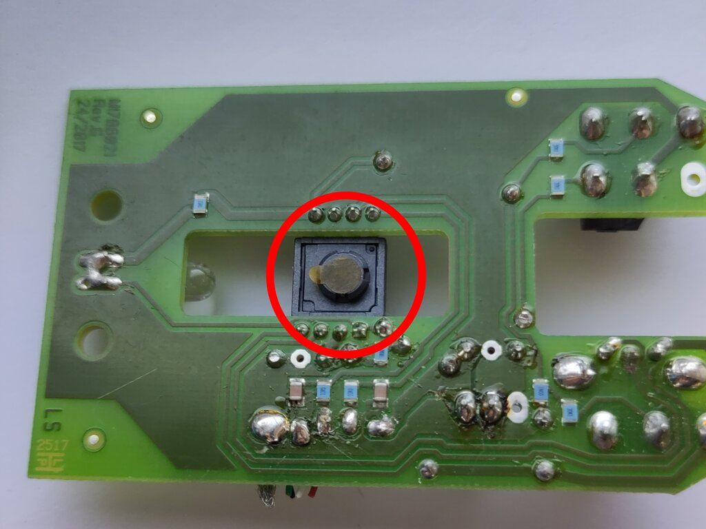

## Finaler Zusammenbau

| | |
| --- | ------ |
| 1. | 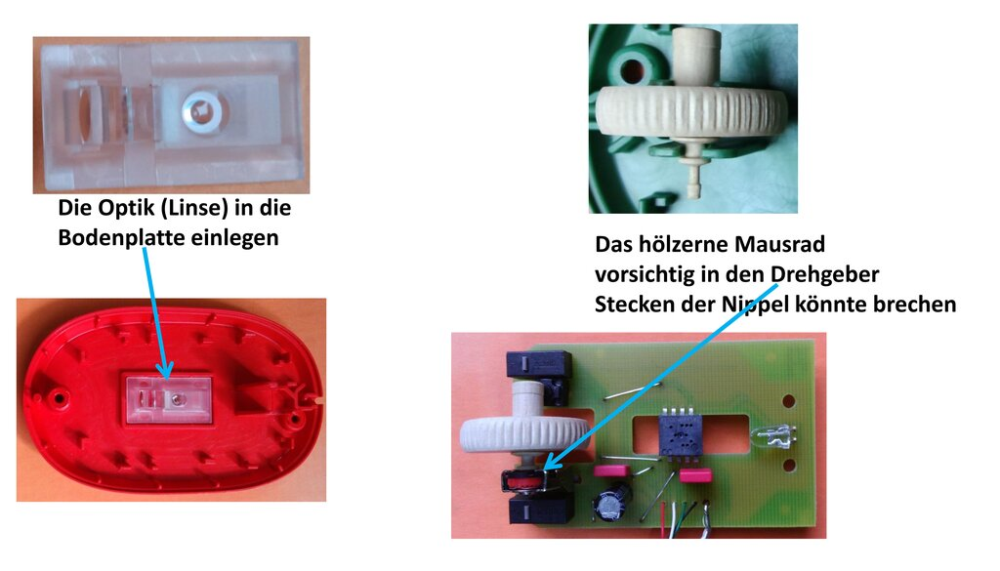 |
| 2. | 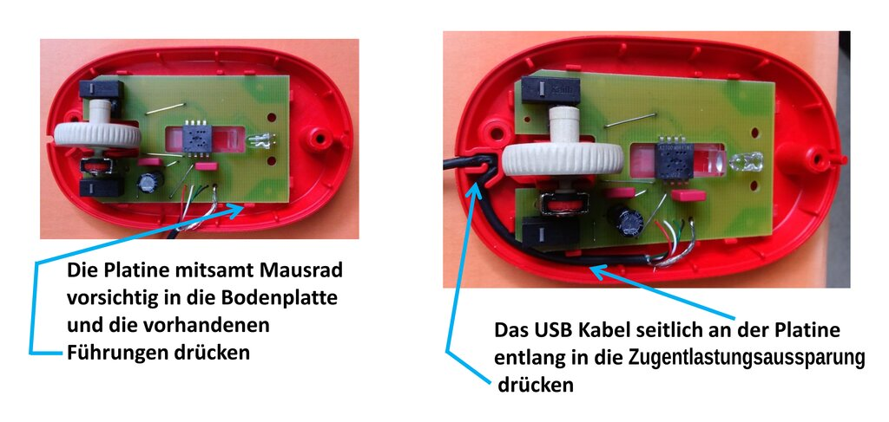 |
| 3. | 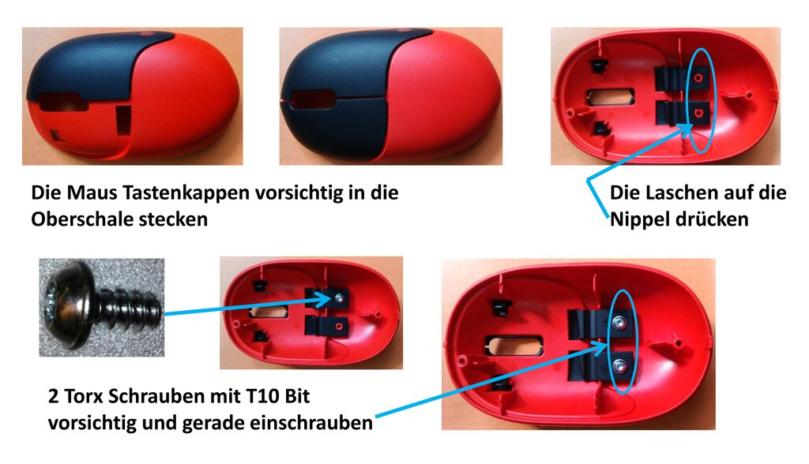 |
| 4. | 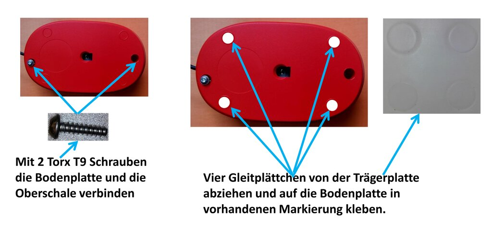 |

Wenn alles richtig gemacht wurde und keine Kurzschlüsse gelötet wurden,
kann die korrekte Funktion der Maus am PC getestet werden.
Nun haben wir eine 3-Tasten USB-Maus,
welche einmalig auf der Welt ist,
da sie selbst zusammengebaut wurde.
